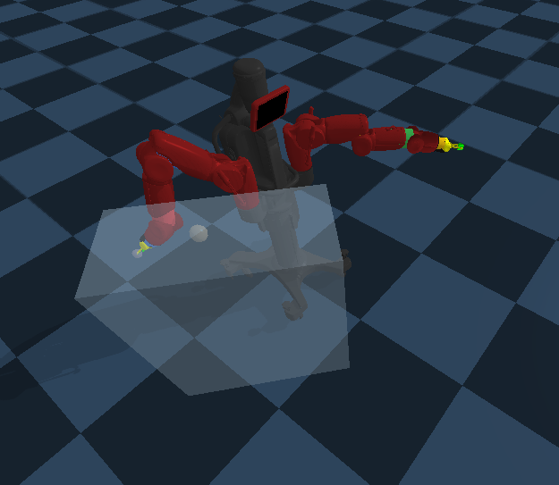

## RoboticsRL

OpenAI gym like Baxter environments in Pybullet simulation. Currently available environments:

- **ReachEnv1**



- **ReachEnv2**

- **PushEnv1**

- **PushEnv2**

- **PushEnv3**

- **GraspEnv1**

- **GraspEnv2**

### Install

``` cd robotics_rl```

``` pip install -e .```
